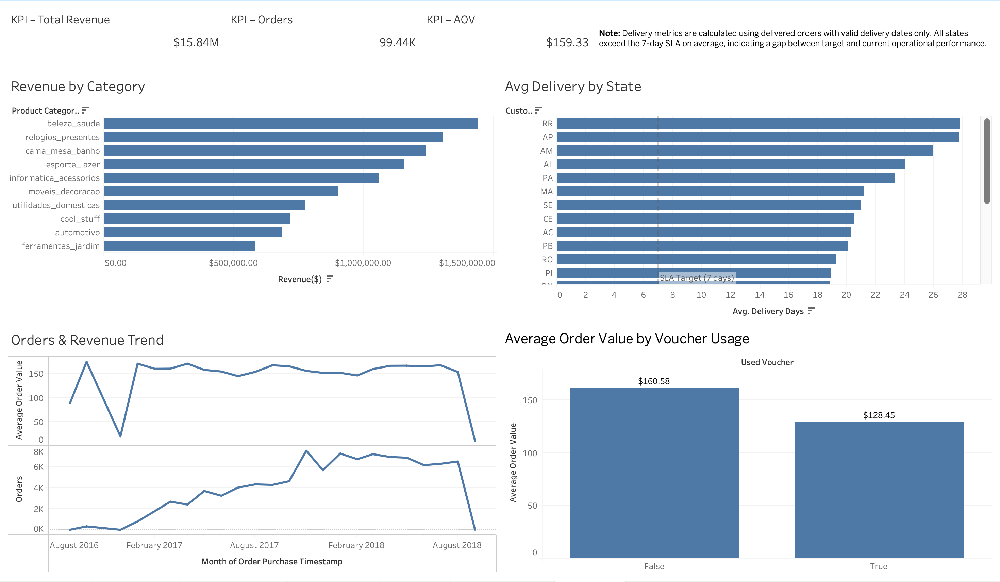

# Retail Sales Analytics – Data Engineering & Analytics

## Overview

This project demonstrates an **end-to-end data engineering pipeline extended into full business analytics and visualization**.

Raw e-commerce data is ingested, cleaned, validated, and transformed using production-style data engineering practices. The curated dataset is then analyzed using SQL and visualized through an executive-style Tableau dashboard to answer real business questions around **revenue, operations, and customer behavior**.

The project intentionally covers **both Data Engineering (DE) and Data Analytics (DA)** responsibilities, mirroring real-world analytics workflows.

---

## Dataset

**Source:** Brazilian E-Commerce Public Dataset by Olist (Kaggle)
[https://www.kaggle.com/datasets/olistbr/brazilian-ecommerce](https://www.kaggle.com/datasets/olistbr/brazilian-ecommerce)

**Description:**

~100,000 real e-commerce orders (2016–2018), including:

* Orders and order items
* Customers and sellers
* Payments and vouchers
* Products and categories
* Geographic information

The data is anonymized and reflects real commercial operations.

---

## Architecture

### High-level flow

```
Raw CSV files
   ↓
Processing & joins
   ↓
Data cleaning & validation
   ↓
Feature engineering
   ↓
Curated analytics dataset (final.csv)
   ↓
SQL analysis & Tableau dashboard
```

### Execution model

* Python scripts implement pipeline logic
* Docker ensures reproducible execution
* Apache Airflow orchestrates pipeline runs
* Tableau Public consumes the curated dataset for analytics

---

## Tools & Technologies

### Data Engineering

* Python 3.11
* Pandas, NumPy
* Docker & Docker Compose
* Apache Airflow 2.9
* PostgreSQL (Airflow metadata)

### Data Analytics

* SQL (DuckDB-style analytical queries)
* Tableau Public (Dashboarding & visualization)

---

## Project Structure

```
retail-sales-analytics/
├── data/
│   ├── raw/            # Original CSV files
│   ├── processed/      # Joined intermediate datasets
│   ├── cleaned/        # Cleaned datasets
│   └── transformed/    # Final curated analytics dataset
│
├── scripts/            # Data engineering pipeline
│   ├── orders_with_items.py
│   ├── ord_itm_cust.py
│   ├── ord_pay.py
│   ├── ord_pay_prod.py
│   ├── ord_prod_sell.py
│   ├── clean.py
│   ├── transform.py
│   └── run_pipeline.py
│
├── analytics/           # SQL analytics layer
│   ├── revenue_analysis.sql
│   ├── delivery_performance.sql
│   ├── voucher_behavior.sql
│   └── run_sql.py
│
├── airflow/
│   ├── dags/
│   │   └── retail_sales_pipeline_dag.py
│   ├── logs/
│   └── docker-compose.yml
│
├── dashboards/
│   └── tableau_dashboard.png
│
├── Dockerfile
├── requirements.txt
└── README.md
```

---

## Pipeline Stages

### 1. Ingestion

* Reads raw CSV files from `data/raw`
* No assumptions or filtering applied

### 2. Processing

* Orders joined with items, customers, payments, products, and sellers
* One-to-many relationships preserved at item level
* Intermediate outputs written to `data/processed`

### 3. Cleaning & Validation

* Datetime normalization
* City name standardization (case, accents, spacing)
* Explicit data quality flags added:

  * `is_delivered`
  * `has_del_date`
  * `has_prod_dim`
  * `has_pay_info`

### 4. Feature Engineering

* Item-level total value calculation
* Delivery duration (`delivery_days`)
* Voucher usage extraction
* Product volume calculation
* Monetary rounding for consistency

### 5. Output

Final analytics-ready dataset:

```
data/transformed/final.csv
```

---

## Data Quality Principles

* No rows dropped silently
* No imputation of missing values
* All real-world data gaps preserved
* Explicit boolean flags used instead of assumptions

This ensures analytical transparency and prevents misleading metrics.

---

## Analytics Layer (SQL)

The curated dataset is analyzed using SQL to answer key business questions:

* Revenue and order volume trends
* Category-level revenue contribution
* Delivery performance by state
* Voucher usage impact on average order value

All SQL queries respect correct aggregation levels to avoid overcounting.

---

## Tableau Dashboard

### Dashboard Title

**E-Commerce Sales & Delivery Performance Dashboard**

### Key Insights

* **Revenue & Orders:** $15.8M revenue across ~99K orders
* **Category Performance:** A small number of categories drive a majority of revenue
* **Delivery Operations:** No state meets the 7-day delivery SLA on average
* **Customer Behavior:** Orders using vouchers show lower average order value

### Dashboard Features

* Executive KPI summary (Revenue, Orders, AOV)
* Revenue by product category
* Average delivery days by state with SLA reference line
* Orders and AOV trends over time
* Voucher impact on customer spending

📊 **Dashboard Screenshot:**



🔗 **Tableau Public Link:** *(https://public.tableau.com/app/profile/sri.murari.dachepalli/viz/E-CommerceSalesDeliveryPerformanceDashboard/Dashboard1)*

---

## Running the Pipeline

### Using Docker

```bash
docker build -t retail-sales-pipeline .

docker run --rm \
  -v $(pwd)/data:/app/data \
  retail-sales-pipeline
```

---

## Orchestration with Airflow

```bash
cd airflow
docker compose up -d
```

Access UI at:

```
http://localhost:8080
```

Trigger `retail_sales_pipeline` DAG to execute the pipeline end-to-end.

---

## Key Takeaways

* Built a modular, reproducible data pipeline
* Preserved real-world data imperfections transparently
* Created an analytics-ready dataset for SQL and BI
* Designed a business-focused Tableau dashboard
* Demonstrated both DE and DA skill sets in one project
